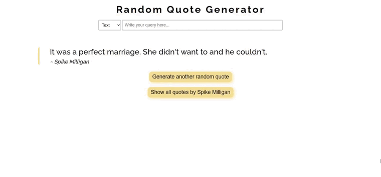

<!-- Please update value in the {} -->

  

<h1  align="center">Random Quote Generator</h1>

  

Solution for a challenge from <a  href="http://devchallenges.io"  target="_blank">Devchallenges.io</a>.

  

<h3>

<a  href="https://{your-demo-link.your-domain}">

Demo

</a>

 | 

<a  href="https://{your-url-to-the-solution}">

Solution

</a>

 | 

<a  href="https://devchallenges.io/challenges/8Y3J4ucAMQpSnYTwwWW8">

Challenge

</a>

</h3>

  

<!-- TABLE OF CONTENTS -->

  

## Table of Contents

  

-  [Overview](#overview)
- [Features](#features)

-  [Built With](#built-with)

-  [Contact](#contact)

  

## Overview

  

## Features
That is my first project using `React`. Although my main idea was to replicate the original challenge, as long as I was advancing with the app, some new features came to my mind so, I couldn't stop myself from setting them up.

-   I added an input to do queries. You can do text search query or author search query
-   I added pagination so you can see all quotes written by the author (or all search queries)

I wanted to focus on functional components and practice on that, so the app style doesn't exactly look like the design.

Spinner loader is from [loading.io](https://loading.io/css)

### Built With
-  React
- Webpack

## Contact
- GitHub [@Yaiza16](https://github.com/yaiza16)

